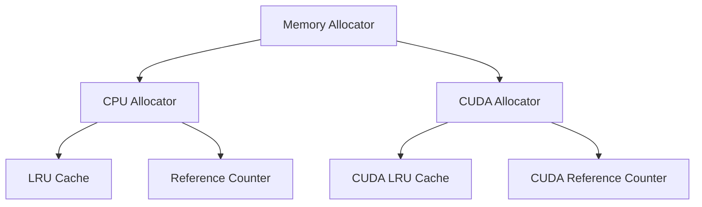

# Memory Allocator

This document describes the design and implementation of the LRU cache-based memory allocator used in the project.

## Architecture

The memory allocator consists of the following components:



## Core Components

### 1. Allocator Trait

```rust
pub trait Allocator {
    fn allocate(&mut self, layout: Layout, device_id: usize) -> Result<*mut u8, TensorError>;
    fn deallocate(&mut self, ptr: *mut u8, layout: &Layout, device_id: usize);
    fn insert_ptr(&mut self, ptr: *mut u8, device_id: usize);
    fn clear(&mut self);
}
```

### 2. Storage Trait

```rust
pub trait Storage {
    fn increment_ref(&mut self, ptr: SafePtr);
    fn decrement_ref(&mut self, ptr: SafePtr) -> bool;
}
```

## Memory Management Strategy

### LRU Cache Strategy

1. **Allocation Process**:
   - Check if memory with the same layout exists in cache
   - If found, retrieve from cache
   - If not found, allocate new memory
   - If cache is full, free least recently used memory

2. **Deallocation Process**:
   - Decrease reference count
   - When reference count reaches 0:
     - Remove from allocated set
     - Put memory into cache
     - If cache is full, free least recently used memory

### Reference Counting

- Uses `HashMap` to store reference counts for each pointer
- Manages references through `increment_ref` and `decrement_ref`
- Automatically recycles memory when reference count reaches 0

## Safety Considerations

1. **Thread Safety**:
   - Global state protected by `Mutex`
   - `SafePtr` implements `Send` and `Sync` traits

2. **Memory Safety**:
   - Automatic null pointer checks
   - Prevention of double-free
   - Automatic cleanup of all memory on program exit

## Usage Examples

### CPU Memory Allocation

```rust
let mut allocator = CACHE.lock().unwrap();
let layout = Layout::from_size_align(size, align).unwrap();
let ptr = allocator.allocate(layout, 0)?;
```

### CUDA Memory Allocation

```rust
let mut allocator = CUDA_CACHE.lock().unwrap();
let layout = Layout::from_size_align(size, align).unwrap();
let (ptr, device) = allocator.allocate(layout, device_id)?;
```

## Implementation Details

### Global Cache

The allocator uses a global cache to manage memory lifetime. See implementation [here](https://github.com/Jianqoq/Hpt/blob/d9a51874b3447d562b7c9d043b50eb05259b78c4/tensor-allocator/src/allocators/cpu.rs#L11).

### Memory Pool

Memory pools are used to reduce allocation overhead:

```rust
pub struct MemoryPool {
    cache: LRUCache<Layout, Vec<*mut u8>>,
    allocated: HashSet<*mut u8>,
    ref_count: HashMap<*mut u8, usize>,
}
```

## Best Practices

1. **Memory Leak Prevention**:
   - Ensure proper reference count management
   - Use RAII pattern for resource management
   - Check for leaks on program exit

2. **Performance Optimization**:
   - Use LRU cache to reduce allocation overhead
   - Minimize memory fragmentation
   - Batch allocations when possible
